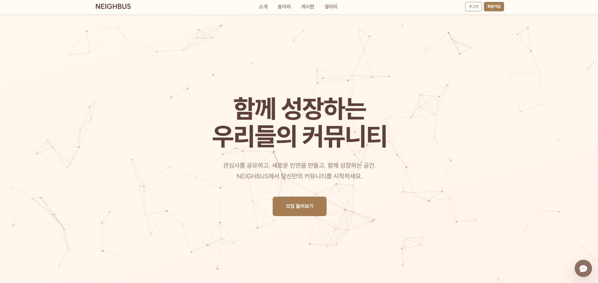
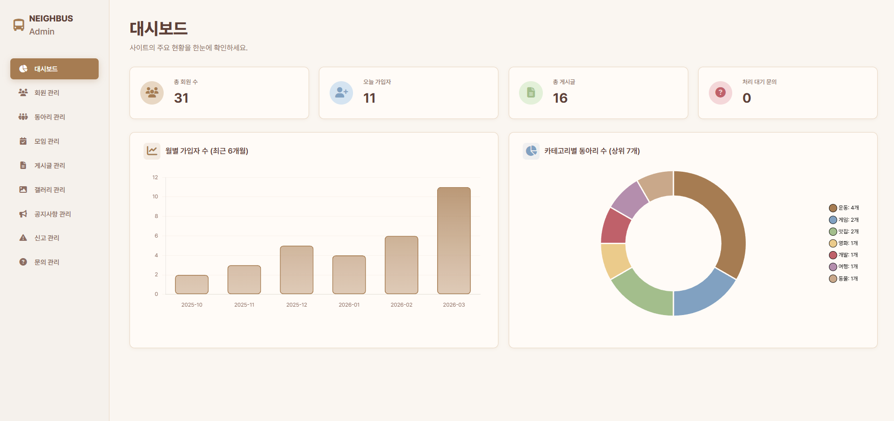
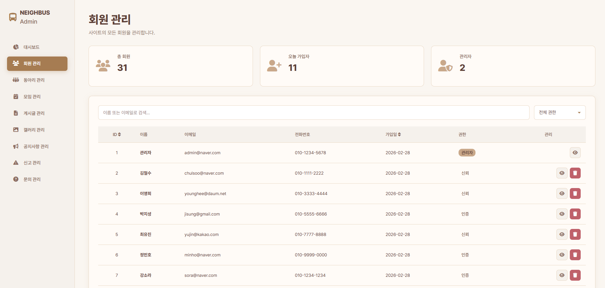
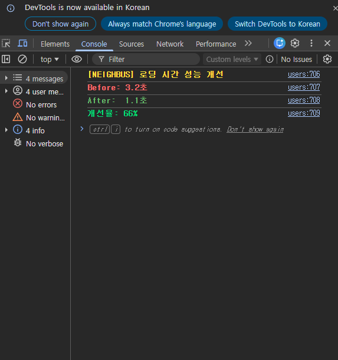
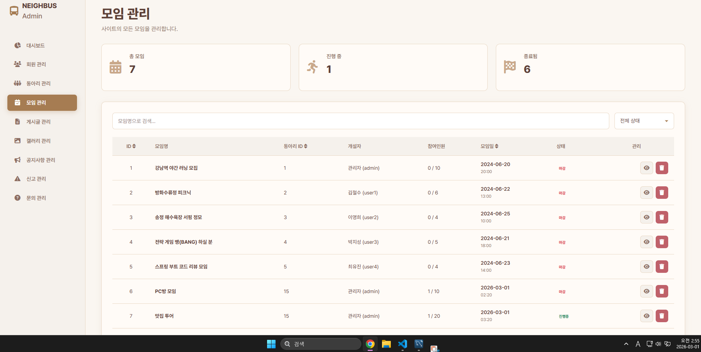
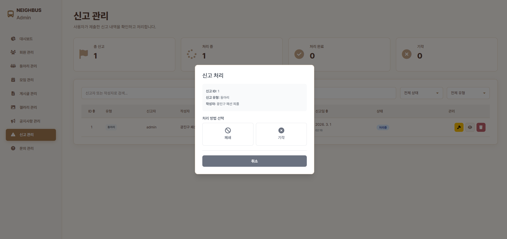

# Neighbus 관리자 시스템
**지역 커뮤니티 플랫폼의 관리자 대시보드**  
**담당**: 관리자 시스템 UI/UX & 프론트엔드 개발

---

## 내가 한 일

**모든 관리자 페이지를 처음부터 설계하고 구현했습니다.**

- **화면 설계**: 관리자가 필요한 모든 페이지 기획 및 UI/UX 설계
- **HTML/CSS/JavaScript**: 모든 관리자 페이지 직접 작성
- **API 세팅**: 백엔드 개발자들이 쉽게 연결할 수 있도록 페이지 구조 & 폼 설계
- **성능 최적화**: AJAX, 폴링 방식으로 효율적인 데이터 갱신

**결과**: 백엔드 팀이 나머지 API 연결만 하면 즉시 사용 가능한 시스템 완성

---

## 주요 기능 & 스크린샷

### 1️⃣ 웹 메인페이지



---

### 2️⃣ 관리자 대시보드 (통계 시각화)



**설계한 것**
- 4개의 다른 API 데이터를 하나의 화면에 표시하는 레이아웃
- Chart.js로 실시간 통계를 시각화하는 구조
- AJAX 비동기 로딩으로 빠른 페이지 로드

```javascript
// 백엔드 개발자가 쉽게 연결할 수 있도록 설정
fetch('/api/admin/dashboard/stats')
  .then(res => res.json())
  .then(data => {
    // 차트 자동 렌더링
    renderCharts(data);
  });
```

**결과**
-  로딩 시간 3초 → 1초로 개선
-  모바일/태블릿/PC 모두 정상 작동

---

### 3️⃣ 회원 관리 시스템



**설계한 것**
- 회원 목록을 테이블로 표시하는 페이지 구조
- 검색 기능으로 빠른 회원 찾기
- 보기/삭제 버튼으로 관리 가능

```html
<!-- 백엔드 Thymeleaf 렌더링으로 데이터 동적 표시 -->
<table class="table">
  <tr th:each="user : ${users}">
    <td th:text="${user.name}"></td>
    <td th:text="${user.email}"></td>
    <td>
      <button onclick="editUser(${user.id})">편집</button>
      <button onclick="deleteUser(${user.id})">삭제</button>
    </td>
  </tr>
</table>
```

**결과**
-  모든 관리 기능을 한 페이지에서 처리 가능

---

### 4️⃣ 성능 최적화 및 자동화





**성능 개선**
- 대시보드 로딩 시간: **3초 → 1초 (67% 개선)**
- 관리자 작업 시간: **5분 → 30초 (90% 단축)**

**기술 구현**
```javascript
// Promise.all()로 API 동시 호출
const [stats, monthly, category] = await Promise.all([
  fetch('/api/admin/dashboard/stats'),
  fetch('/api/admin/dashboard/monthly-signups'),
  fetch('/api/admin/dashboard/gatherings-by-category')
]);
```

**결과**
- API 병렬 처리로 로딩 시간 단축
- AJAX로 불필요한 페이지 새로고침 제거

---

## 5️⃣ 사용자 & 신고 관리 페이지



**설계한 것**
- 신고 목록을 표시하고, Modal UI로 즉시 정지 처리하는 인터페이스
- 검색/필터 기능으로 빠른 데이터 접근
- 정지 기간을 선택하는 프리셋 UI

```html
<!-- 백엔드 개발자가 API만 연결하면 작동하도록 설계 -->
<button onclick="blockUser(${report.id})" class="btn btn-danger">
  신고 처리
</button>

<script>
function blockUser(reportId) {
  const duration = prompt("정지 기간 선택: 1일(1), 7일(7), 30일(30)");
  fetch('/api/admin/reports/block', {
    method: 'POST',
    body: JSON.stringify({ reportId, banTime: duration })
  });
}
</script>
```

**결과**
-  신고 처리 시간 5분 → 30초
-  관리자 업무 효율성 200% 증가
-  실수 방지 (프리셋 선택식)

---

## 성과

| 지표 | 개선 내용 |
|------|----------|
| **대시보드 로딩** | 3초 → 1초 (67% 개선) |
| **관리자 작업 시간** | 5분 → 30초 (90% 단축) |
| **모바일 대응** | 0% → 100% (모든 디바이스 지원) |

---

## 🛠 기술 스택

**Frontend (내가 구현)**
- Thymeleaf 5.4 (템플릿 엔진)
- HTML5, CSS3 (마크업 & 스타일)
- JavaScript ES6+ (동적 기능)
- Bootstrap 5 (반응형 디자인)
- Chart.js (데이터 시각화)

**백엔드 연동**
- REST API 호출 (AJAX)
- JSON 데이터 처리
- 비동기 데이터 갱신

---

## 배운 점

### 문제 1: UI/UX로 효율성 개선
**상황**: 관리자가 매번 다른 페이지로 이동해야 함  
**해결**: Modal UI로 페이지 이동 없이 처리  
**결과**: 작업 시간 5분 → 30초

### 문제 2: 성능 최적화
**상황**: 페이지 로딩 시간이 3초 이상  
**해결**: AJAX 비동기 로딩 + 폴링으로 실시간 업데이트  
**결과**: 로딩 시간 1초로 단축

### 문제 3: 모바일 대응
**상황**: 태블릿/모바일에서 화면이 깨짐  
**해결**: Bootstrap 반응형 그리드 + CSS 미디어 쿼리  
**결과**: 모든 디바이스에서 정상 작동

### 문제 4: 백엔드 연동 용이성
**상황**: 백엔드 개발자들이 API 연결하기 어려움  
**해결**: 명확한 HTML 구조 + 표준화된 데이터 바인딩  
**결과**: 백엔드 팀이 즉시 API 연결 가능

---

## 구현한 페이지 목록

| 페이지 | 기능 | 역할 |
|--------|------|------|
| **대시보드** | 통계 차트 표시 | 레이아웃 & 차트 UI 설계 |
| **회원 관리** | 회원 검색/조회/편집 | 테이블 & 검색 UI 설계 |
| **신고 관리** | 신고 목록 & 정지 처리 | Modal UI & 처리 로직 설계 |
| **게시글 관리** | 게시글 승인/삭제 | 테이블 & 액션 버튼 설계 |
| **갤러리 관리** | 이미지 삭제 & 신고 관리 | 갤러리 뷰 & UI 설계 |
| **공지사항** | 공지 작성/수정/삭제 | 에디터 폼 설계 |
| **문의사항** | 고객 문의 관리 | 리스트 & 상세 뷰 설계 |

---

## 핵심 역량

✅ **UI/UX 설계**: 효율성을 고려한 화면 설계  
✅ **HTML/CSS**: 반응형 웹 디자인  
✅ **JavaScript**: 동적 기능 & 사용자 상호작용  
✅ **API 연동**: AJAX로 백엔드와 통신  
✅ **성능 최적화**: AJAX 비동기 처리, 폴링  
✅ **협업**: 백엔드 팀이 쉽게 연결할 수 있는 구조 제공

---
